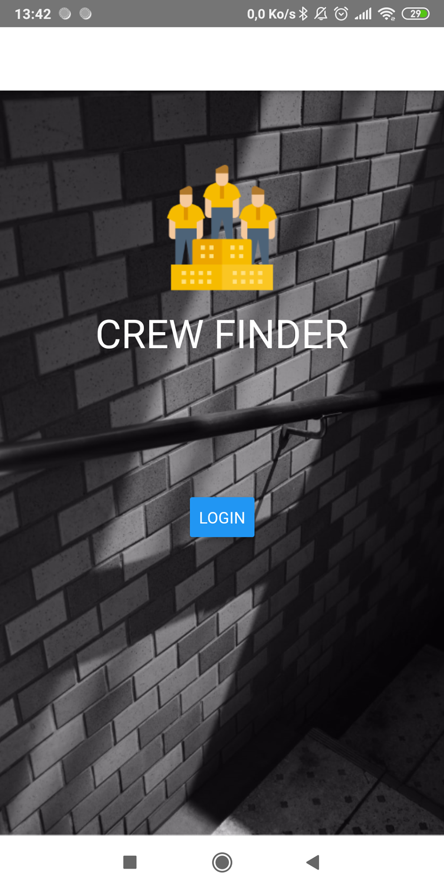
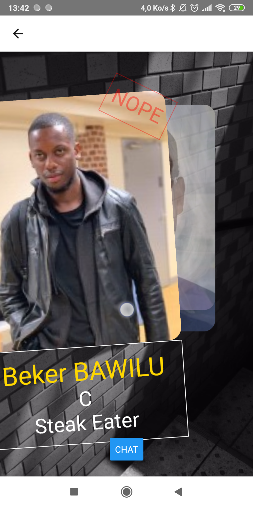

# Crew Finder
# React Native App

## Introduction

Crew Finder helps you find your team mate for a project. With the Tinder app model, you can swipe left until you have found the perfect match according to the skills and the job.

## Technical sheet

We have three pages. One for the authentification system, another one to see the different cards and a chat. 
For the Login page, we decided to use a simple button to access the other pages, to do that, we used <b>react-native-navigation</b> and <b>react-native-navigation-stack</b>, you can find the navigation in the <b>components/App.js.</b>
For the “finder” page, we wanted to recreate something similar to the Tinder app swipe system, we used PanResponder from react-native to do so, you can find all the details in <b>components/Finder.js</b>.
And lastly, for the “chat” page, we simply used <b>react-native-gifted-chat</b>, It’s a simple chat system, you can type messages in a chat bar, all the details can be found in <b>components/Chat.js.</b>

